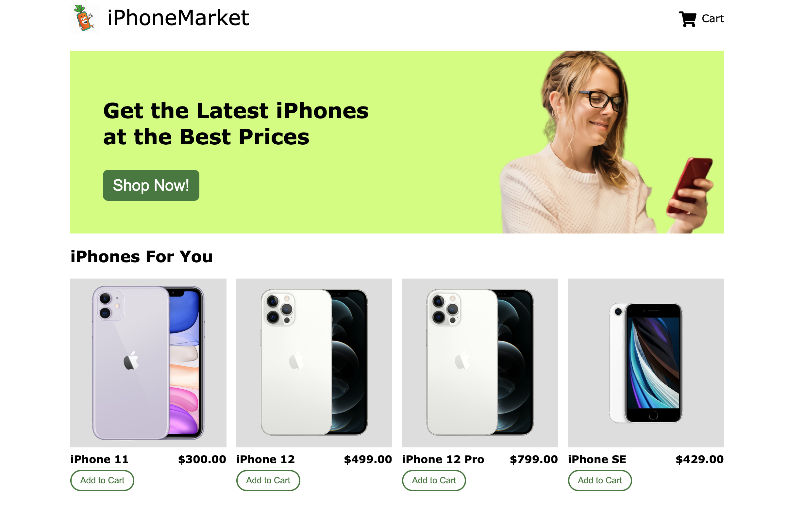

# netlify-functions-ecommerce

This sample demonstrates using Mongoose to build an eCommerce shopping cart using [Netlify Functions](https://www.netlify.com/products/functions/), which runs on [AWS Lambda](https://mongoosejs.com/docs/lambda.html).

Other tools include:

* Stripe for payment processing
* [Mocha](https://masteringjs.io/mocha) and [Sinon](https://masteringjs.io/sinon) for testing



## 📋 How to

- [01. Create Astra Account](#-1---create-your-datastax-astra-account)
- [02. Create Astra Token](#-2---create-an-astra-token)
- [03. Create a Database](#-3---create-a-database)
- [04. Setup Project](#-4---setup-project)
- [05. Run the project](#-5---run-the-project)


#### ✅ `1` - Create your DataStax Astra account

> ℹ️ Account creation tutorial is available in [awesome astra](https://awesome-astra.github.io/docs/pages/astra/create-account/)

_click the image below or go to [https://astra.datastax./com](bit.ly/3QxhO6t)_

<a href="bit.ly/3QxhO6t">

</a>


#### ✅ `2` - Create an Astra Token

> ℹ️ Token creation tutorial is available in [awesome astra](https://awesome-astra.github.io/docs/pages/astra/create-token/#c-procedure)

- `Locate ` Settings ` (#1) in the menu on the left, then `Token Management` (#2)

- Select the role `Organization Administrator` before clicking `[Generate Token]`


The Token is in fact three separate strings: a `Client ID`, a `Client Secret` and the `token` proper. You will need some of these strings to access the database, depending on the type of access you plan. Although the Client ID, strictly speaking, is not a secret, you should regard this whole object as a secret and make sure not to share it inadvertently (e.g. committing it to a Git repository) as it grants access to your databases.

```json
{
  "ClientId": "ROkiiDZdvPOvHRSgoZtyAapp",
  "ClientSecret": "fakedfaked",
  "Token":"AstraCS:fake"
}
```

#### ✅ `3` - Create a Database

If you are creating a new account, you will be brought to the DB-creation form directly.

Otherwise, get to the databases dashboard (by clicking on Databases in the left-hand navigation bar, expanding it if necessary), and click the `[Create Database]` button on the right.


Take a moment to fill the form:

- **ℹ️ Fields Description**

| Field                                      | Description                                                                                                                                                                                                                                    |
|--------------------------------------------|------------------------------------------------------------------------------------------------------------------------------------------------------------------------------------------------------------------------------------------------|
| **Vector Database vs Serverless Database** | `PICK VECTOR` In june 2023, Cassandra introduced the support of vector search to enable Generative AI use cases. You might consume your credit faster with a vector database.                                                                  |
| **database name**                          | It does not need to be unique, is not used to initialize a connection, and is only a label (keep it between 2 and 50 characters). It is recommended to have a database for each of your applications. The free tier is limited to 5 databases. |
| **keyspace**                               | No requirement                                                                                                                                                                                                                                 |
| **Cloud Provider**                         | Choose whatever you like. Click a cloud provider logo, pick an Area in the list and finally pick a region. We recommend choosing a region that is closest to you to reduce latency. In free tier, there is very little difference.             |


#### ✅ `4` - Setup project

detailed instructions in [ecommerce App README](netlify-functions-ecommerce/README.md)

- **Setting up .env file to run against AstraDB**

1. Copy the `.env.example` file to `.env` and fill in the values for the environment variables.
2. Set `IS_ASTRA` to `true`
3. Set `ASTRA_DB_ID` to your AstraDB database ID
4. Set `ASTRA_DB_REGION` to your AstraDB database region
5. Set `ASTRA_DB_KEYSPACE` to your AstraDB keyspace
6. Set `ASTRA_DB_APPLICATION_TOKEN` to your AstraDB application token
7. Remove `JSON_API_URL`, `JSON_API_AUTH_URL`, `JSON_API_AUTH_USERNAME`, `JSON_API_AUTH_PASSWORD`.

#### ✅ `5` - Run the project

detailed instructions in [ecommerce App README](netlify-functions-ecommerce/README.md)

1. Run `npm install`
2. Run `npm run seed`
3. Run `npm run build` to compile the frontend
4. (Optional) set `STRIPE_SECRET_KEY` to a test Stripe API key in your `.env` file. This will allow you to enable Stripe checkout.
5. Run `npm start`
   Run `npm run test:smoke` to run a smoke test against `http://127.0.0.1:8888` that creates a cart using [Axios](https://masteringjs.io/axios).
6. Visit `http://127.0.0.1:8888/` to see the UI

Then run `npm test`.

```sh
$ npm test

> test
> mocha ./test/*.test.js

Using test


  Add to Cart
    ✔ Should create a cart and add a product to the cart
    ✔ Should find the cart and add to the cart
    ✔ Should find the cart and increase the quantity of the item(s) in the cart

  Checkout
    ✔ Should do a successful checkout run

  Get the cart given an id
    ✔ Should create a cart and then find the cart.

  Products
    ✔ Should get all products.

  Remove From Cart
    ✔ Should create a cart and then it should remove the entire item from it.
    ✔ Should create a cart and then it should reduce the quantity of an item from it.


  8 passing (112ms)
```
